Ten poradnik trzeba wykonać w kolejności, tak jakbyś konfigurował plik kanału po raz pierwszy. Przedstawia w naturalny sposób niektóre narzędzia i funkcje związane z kanałem osobistym.

### Tworzenie nowego kanału

Kiedy logujesz się po raz pierwszy po rejestracji, musisz utworzyć kanał albo odwiedzić później stronę *https://your_website/new_channel*.

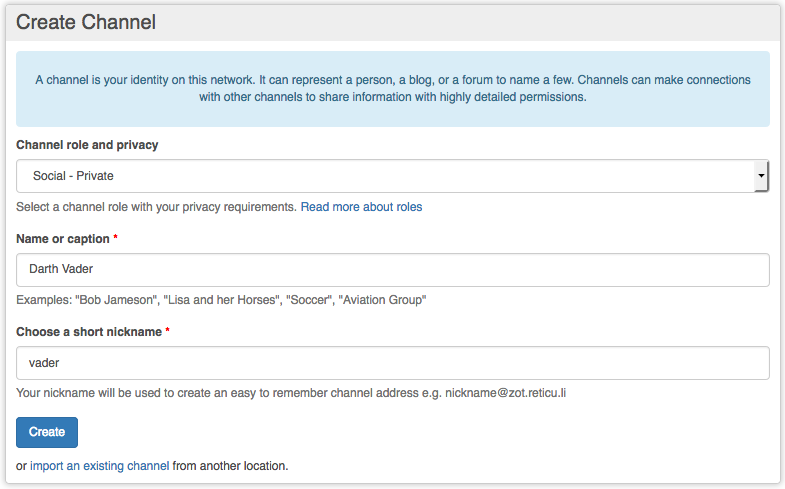

Wprowadź swoje imię i nazwisko oraz pseudonim dla adresu kanału, a następnie wybierz "rolę". Zazwyczaj, jeśli reprezentuje Cię osobisty kanał, wybierz *Społeczność* z domyślnym poziomem prywatności, który Ci odpowiada. Jeśli nie masz pewności, wybierz opcję *Społecznościowe - głównie publiczne*, co umożliwia łatwą interakcję i zapewnia prywatność, gdy jej potrzebujesz. Alternatywnie, ustawienie *Społecznościowe - ograniczone* jest bardzo popularne wśród obrońców prywatności, chociaż poznanie ludzi może wymagać nieco więcej wysiłku. Niezależnie od tego, które ustawienie wybierzesz, możesz zmienić je później, jeśli zajdzie taka potrzeba.

### Dodanie zdjęcia profilowego

Po utworzeniu nowego kanału zostaniesz przekierowany na stronę określoną przez administratora witryny. Domyślnie jest to strona * Edytuj profil *.

Z poziomu rozwijanego menu *Narzędzia profili* wybierz opcję *Zmień zdjęcie profilowe* (lub po prostu kliknij zdjęcie profilowe).

Prześlij swoje zdjęcie i jeśli to konieczne, zmień rozmiar za pomocą edytora obrazów.

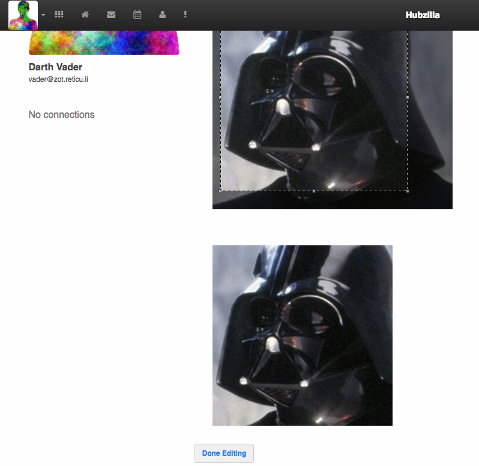

Po naciśnięciu *Edycja zakończona* nastąpi przekierowanie z powrotem do edytora profili.

> Jeśli masz problemy z wyświetleniem nowego zdjęcia, może być konieczne
> wyczyszczenie pamięci podręcznej przeglądarki.

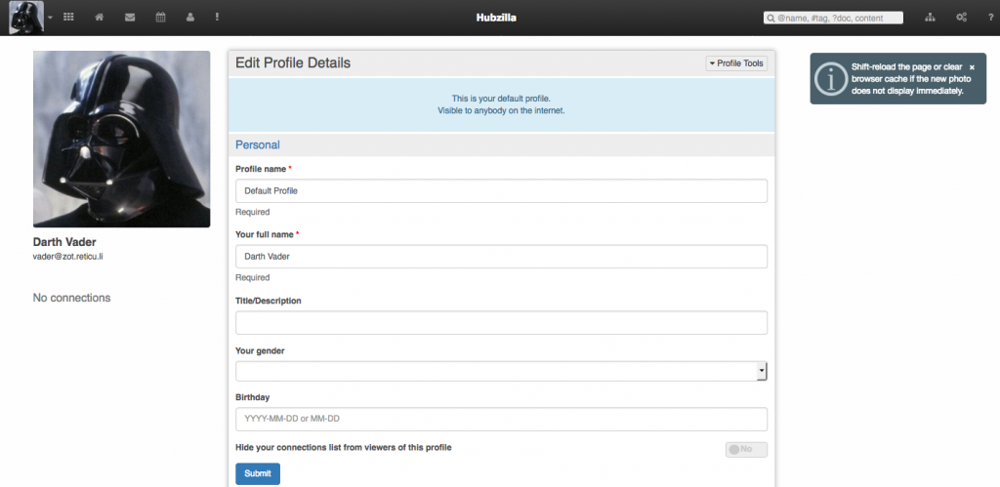

Po powrocie na stronę główną kanału zobaczysz, że wpis powiadamiający innych o Twoim nowym zdjęciu profilowym, który został automatycznie opublikowany.

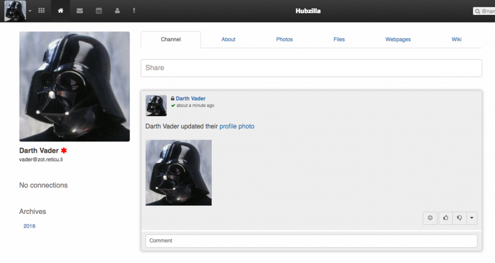

### Tworzenie wpisów

Przejdź do strony głównej swojego kanału i otwórz edytor wpisów, naciskając pole tekstowe *Udostępnij* u góry "ściany"  kanału. Wprowadź wiadomość, a następnie przeciągnij i upuść plik obrazu do do obszaru tekstowego edytora postów. Ewentualnie możesz użyć narzędzie *Załącz plik*, widoczne u dołu.

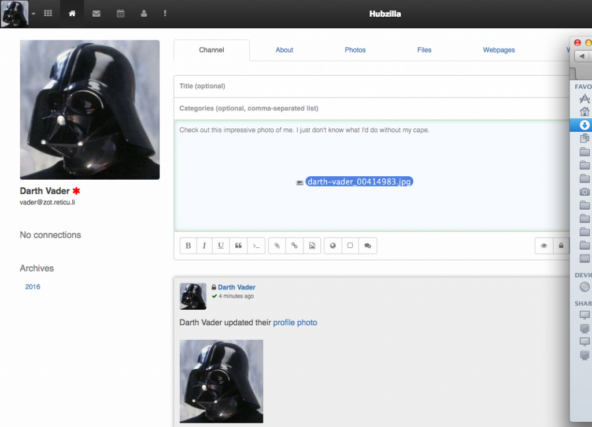

Plik obrazu zostanie automatycznie przesłany i zapisany w plikach w chmurze, a łącze pojawi się w oknie wpisu. Naciśnięcie przycisku podglądu wpisu umożliwia podgląd wpisu przed opublikowaniem.

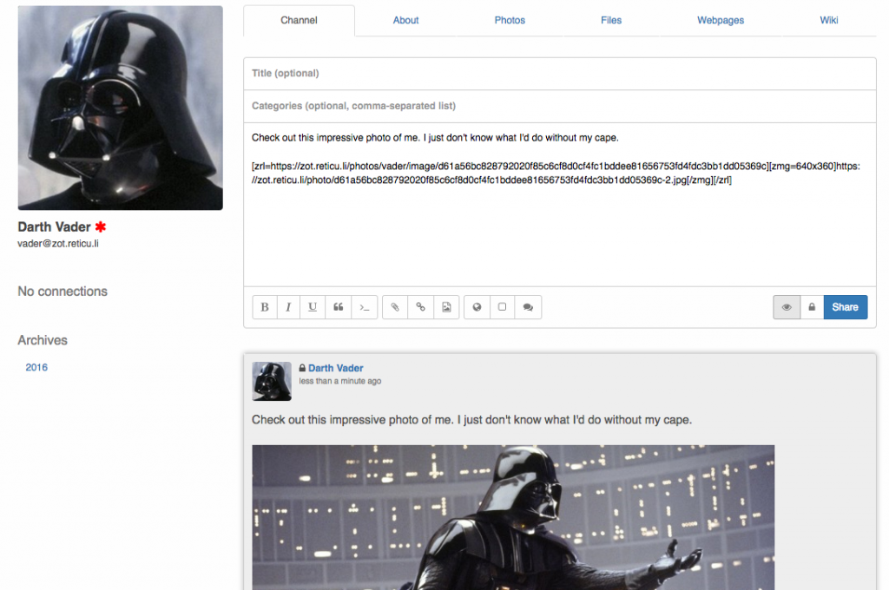

Naciśnij przycisk kłódki obok przycisku *Prześlij*. SPowoduje to otworzenie się *Listę kontroli dostępu*, gdzie możesz dokładnie określić, kto ma dostęp do tego wpisu.

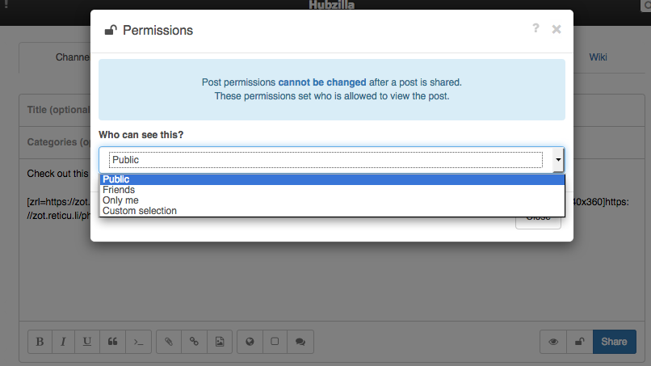

### Użycie przesłanego obrazu jako zdjęcia na okładkę kanału

Jednym ze sposobów uatrakcyjnienia wyglądu kanału jest dodanie zdjęcia na okładkę, które będą widzieć użytkownicy po załadowaniu strony kanału. Zintegrowany system plików w chmurze pozwala wybrać w tym celu istniejące zdjęcie.

Odwiedź swoje zdjęcia w aplikacji *Photos*.

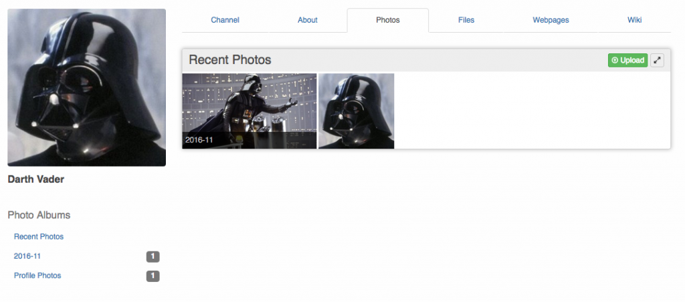

Wybierz zdjęcie, którego chcesz użyć i wybierz *Użyj jako zdjęcia na okładkę* z rozwijanego menu *Narzędzia do zdjęć*.

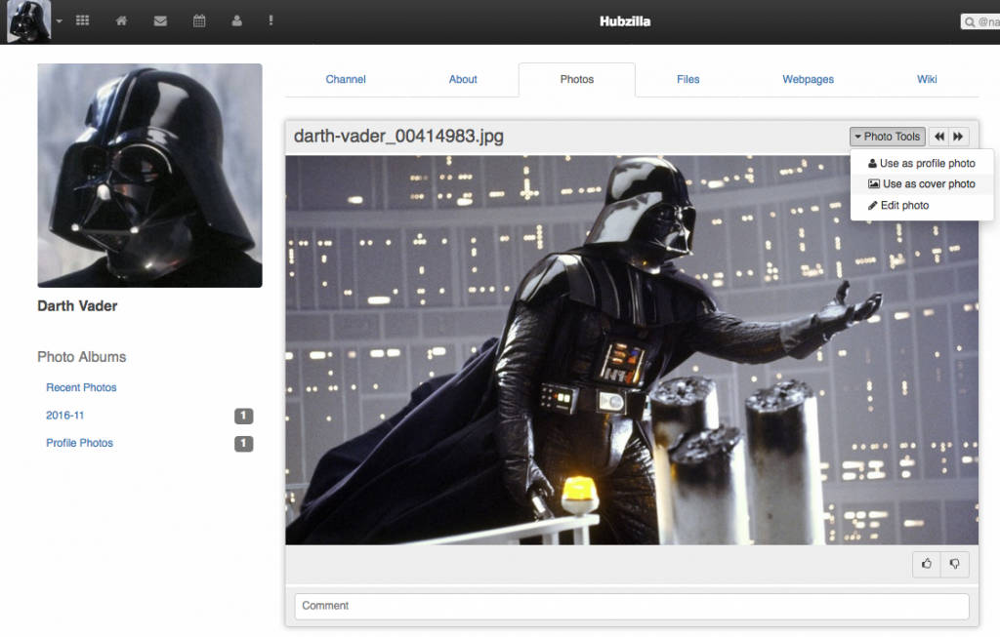

Przytnij obraz za pomocą edytora zdjęć i zapisz zmiany.

Gdy załadujesz stronę główną swojego kanału, najpierw zobaczysz zdjęcie okładkowe a strona kanału będzie się pojawiać w miarę przewijania w dół.

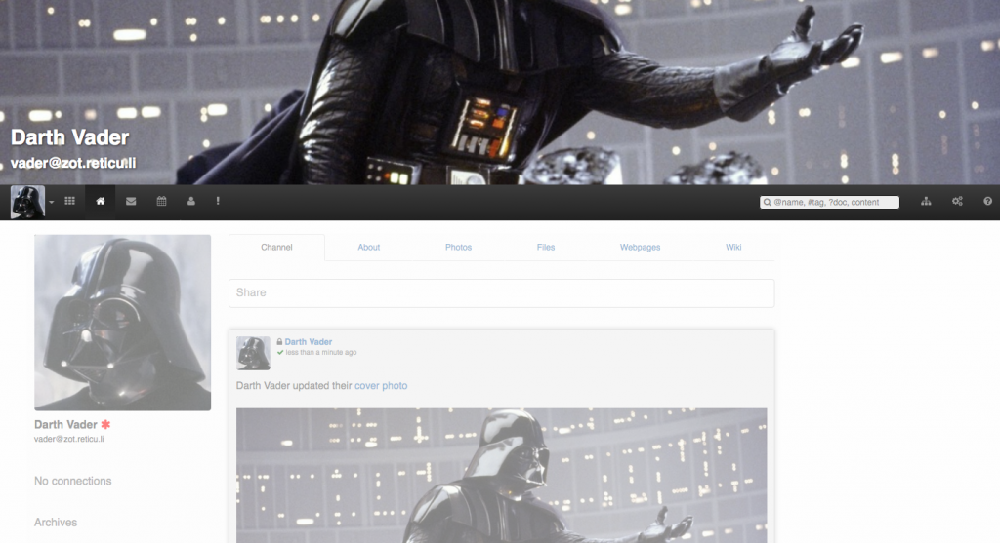

### Wykonywanie połączeń

Tworzenie połączeń między kanałami i udostępnianie treści, to istosta komunikacji społecznej. Nawiązanie połączenia jest proste. Jeśli jeszcze nie wiesz, jak dotrzeć do strony domowej kanału, możesz spróbować przeszukać katalog, otwierając łącze *Katalog* z menu po prawej stronie z boku górnego paska nawigacyjnego.

Możesz połączyć się bezpośrednio z poziomu katalogu za pomocą przycisku *Połącz* lub możesz najpierw otworzyć stronę kanału i nacisnąć przycisk *Połącz* widoczny poniżej zdjęcia profilowego.

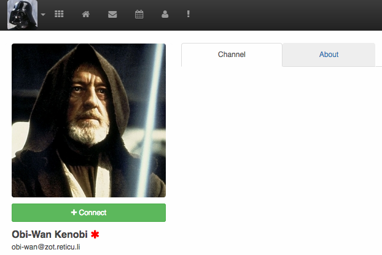

Po nawiązaniu połączenia zostaniesz natychmiast przeniesiony do strony edytora połączeń, gdzie podejmujesz ważne decyzje dotyczące tego, co planujesz udostępniać na tym kanale.

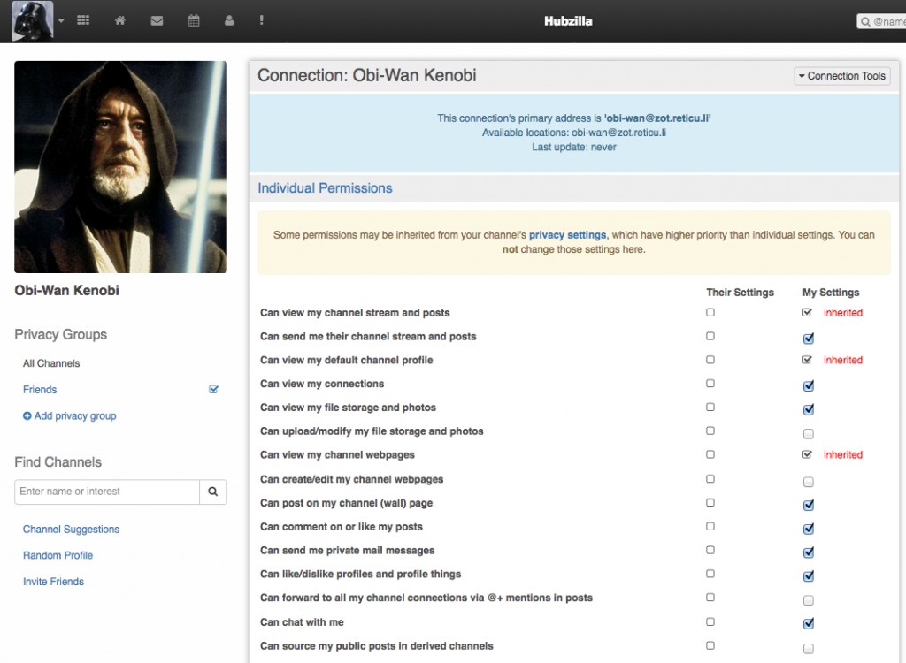

Dwa ważne ustawienia to

* Indywidualne uprawnienia dla nowo podłączonego kanału
* Grupy prywatności, do których należy połączenie

Indywidualne uprawnienia są w większości łatwe do zrozumienia, ale mogą być na początku niejasne. Na przykład *Można wyświetlać mój magazyn plików i zdjęć* nie oznacza, że na podłączonym kanale każdy będzie mógł przeglądać wszystkie Twoje zdjęcia i pliki! Oznacza to, że będziesz mieć możliwość udostępniania zdjęć i plików za pomocą tego kanału. Jest całkiem możliwe, że pozwolisz komuś czytać swoje wpisy, ale nie zezwolisz na oglądanie zdjęć w tym wpisie.

Grupy prywatności umożliwiają wygodnie udostępniać elementy grupom osób. Można utworzyć dowolne grupy odpowiadające swoim potrzebom, otwierając link *Dodaj grupę prywatności*. 

W tym edytorze można przełączać się między istniejącymi grupami prywatności i od razu sprawdzić, jakie kanały są, a jakie nie są członkami grupy. Wybranie ikony kanału w dowolnym polu spowoduje przeniesienie kanału do tej grupy.

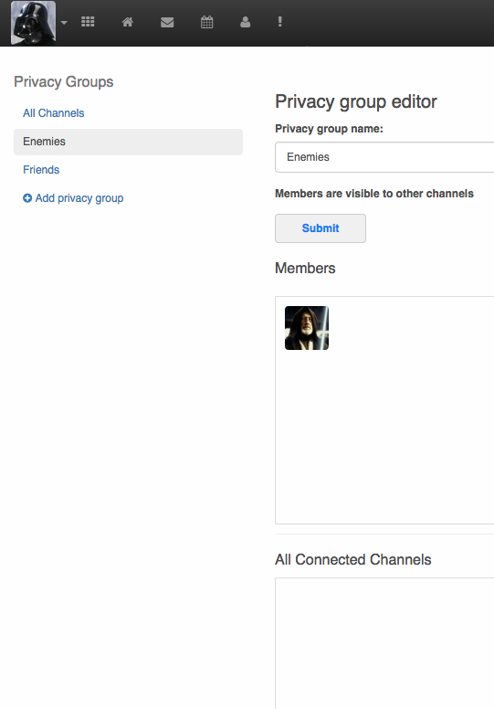

Podczas edycji ustawień pojedynczego kanału można ustawić jego członkostwo w grupach prywatności za pomocą widżetu po lewej stronie:

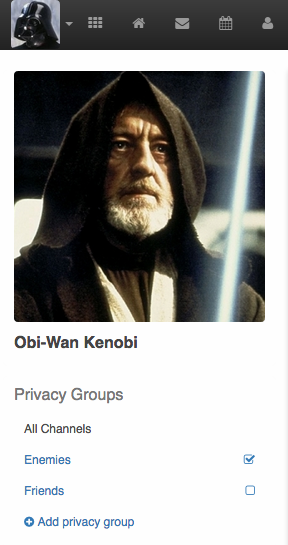

Połączenia to wzajemne zaangażowanie. Kanał, z którym się łączysz, może mieć ustawioną opcję zatwierdzenia połączenia z innym kanałem. Zostanie wówczas wysłane do niego powiadomienie o proonowanym połączeniu:

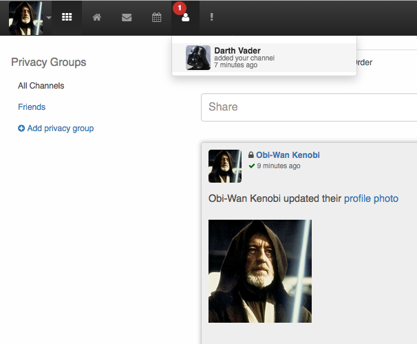

w którym znajduje się link do strony edytora [*Połączenia*](https://grid.reticu.li/connections), gdzie można zdecydować, czy zezwolić na połączenie, czy nie.

Po zatwierdzeniu połączenia dobrze jest otworzyć edytor połączeń indywidualnych, naciskając przycisk edycji obok przycisku *Usuń*.

 
